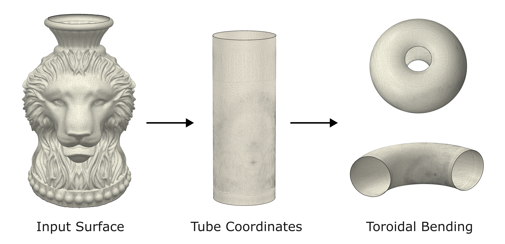

# tube-conformal

<p align="center">
  
</p>

`tube-conformal` is a Python implementation for conformal parameterization and conformal bending of tubular triangular meshes. It maps tube-topology surfaces with two boundary loops to tubular coordinates, and includes boundary extension, ring smoothing, seam-local quasi-conformal correction, and major/minor conformal bending utilities.

The repository includes synthetic meshes, real meshes, core algorithm modules, and benchmark scripts for reproducing the CSV results in `benchmark_results/`.

## Features

- Initial tubular parameterization for tube-like meshes: `initial_tube`
- Seam-local quasi-conformal correction: `tube_conformal_map`
- Boundary extension and smoothing for free-boundary workflows: `raw_extension`, `ring_smooth`
- Major-axis and minor-axis conformal bending: `conformal_bend_major`, `conformal_bend_minor`
- Batch experiments and CSV output: `benchmark.py`

## Repository Layout

```text
.
├── assets/                      # README figures and visual assets
├── src/                         # Core algorithm modules
├── data/
│   ├── synthetic/               # Synthetic .obj tube meshes
│   └── real/                    # Real .obj tube meshes
├── benchmark_results/           # Precomputed benchmark CSV files
├── benchmark.py                 # Batch benchmark script
├── requirements.txt             # Python dependencies
├── LICENSE
└── README.md
```

## Installation

Using a virtual environment is recommended:

```bash
python -m venv .venv
source .venv/bin/activate
pip install -r requirements.txt
```

Main dependencies are `numpy`, `scipy`, `trimesh`, `networkx`, and `matplotlib`.

## Quick Start

The following example loads a tubular `.obj` mesh, computes a tubular conformal map, and saves the mapped mesh:

```python
import numpy as np
import trimesh

from src import initial_tube, tube_conformal_map

mesh = trimesh.load("data/synthetic/straight_01.obj", process=False)
v = np.asarray(mesh.vertices)
f = np.asarray(mesh.faces)

tube0 = initial_tube(v, f)
tube = tube_conformal_map(tube0, f, v, seam_strip_width=0.05)

out = trimesh.Trimesh(vertices=tube, faces=f, process=False)
out.export("straight_01_tube.obj")
```

For the free-boundary workflow with boundary extension and ring smoothing:

```python
import numpy as np
import trimesh

from src import initial_tube, tube_conformal_map, raw_extension, ring_smooth

mesh = trimesh.load("data/synthetic/bent_01.obj", process=False)
v = np.asarray(mesh.vertices)
f = np.asarray(mesh.faces)

v_ext_raw, f_ext = raw_extension(v, f, normal_blend=0.15)
v_ext = ring_smooth(v_ext_raw, f_ext, smooth_weight=0.5)

tube0_ext = initial_tube(v_ext, f_ext)
tube_ext = tube_conformal_map(tube0_ext, f_ext, v_ext, seam_strip_width=0.05)

# Restrict the result back to the original mesh vertices.
tube = tube_ext[: len(v)]
```

## Conformal Bending

The tubular map can be further transformed into torus-like shapes:

```python
import numpy as np

from src import conformal_bend_major, conformal_bend_minor

height = np.max(tube[:, 2]) - np.min(tube[:, 2])

R_major_max = np.sqrt(1 + (2 * np.pi / height) ** 2)
bent_major = conformal_bend_major(tube, R=0.5 * R_major_max + 0.5)

R_minor_min = np.sqrt(1 + (height / (2 * np.pi)) ** 2)
bent_minor = conformal_bend_minor(tube, R=2.0 * R_minor_min)
```

## Benchmarks

Run all benchmark experiments with:

```bash
python benchmark.py
```

The script processes all `.obj` files under `data/synthetic` and `data/real`, then writes CSV files to `benchmark_results/`.

Generated result groups:

- `fixed_results/`: fixed-boundary correction with different seam strip widths
- `free_results/`: boundary extension layers and smoothing weight experiments
- `conformal_bend_results/`: major-axis and minor-axis conformal bending experiments
- `computation_time_results/`: runtime breakdown for each pipeline stage

The full benchmark may take a while. For quick debugging, reduce the file list or parameter grids inside `benchmark.py`.

## Core API

### `initial_tube(v, f)`

Computes an initial tube map. The method finds a shortest path connecting the two boundary loops, slices the surface into a disk, maps it to a parallelogram, and converts the parallelogram coordinates to tubular coordinates `(cos theta, sin theta, z)`.

### `tube_conformal_map(tube0, f, v, seam_strip_width=0.05)`

Applies a local quasi-conformal correction near the angular seam. The initial tube map is converted to an annulus, corrected with a Beltrami-coefficient-based generalized Laplacian on the seam strip, and converted back to tubular coordinates.

### `raw_extension(v, f, normal_blend)`

Adds one outward ring of vertices along each boundary loop and stitches the new rings to the original mesh. `normal_blend` controls how much the extension direction blends toward the vertex normal.

### `ring_smooth(v, f, smooth_weight)`

Smooths the extended boundary rings to reduce local irregularity introduced by raw boundary extension.

### `conformal_bend_major(tube, R)` / `conformal_bend_minor(tube, R)`

Applies conformal bending to a tubular map along the major or minor direction. `R` is the bending radius and should satisfy the radius constraints implied by the formulas used in `src/conformal_bend.py`.

## Input Requirements and Notes

- Input meshes must be triangulated, with face array shape `(n_faces, 3)`.
- Mesh topology must be annular/tubular, with exactly two boundary loops.
- `.obj` files loaded through `trimesh.load` are converted to NumPy arrays with 0-based face indices.
- This repository is not packaged as an installable Python package. Run examples from the repository root, or add the repository root to `PYTHONPATH`.
- `benchmark.py` overwrites CSV files with matching names. Back up old benchmark results before rerunning if needed.

## Citation

If you use this code, please cite:

Shunyu Yao and Gary P. T. Choi, "Conformal tubular parameterization and toroidal bending of tube-like surfaces," arXiv preprint arXiv:2605.16305, 2026. https://arxiv.org/abs/2605.16305

## License

This project is released under the MIT License. See [LICENSE](LICENSE) for details.
